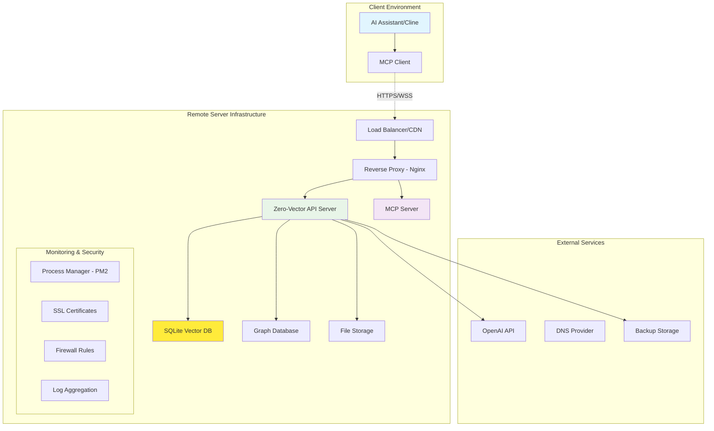

# Zero-Vector MCP v2.0: Remote Hosting & Production Deployment Guide

**Version**: 1.0  
**Updated**: June 18, 2025  
**Scope**: Production-ready remote deployment for Zero-Vector Server + MCP  

## 🎯 Overview

This guide provides comprehensive instructions for deploying Zero-Vector MCP v2.0 in production environments, enabling remote access to AI memory and knowledge graph capabilities through secure, scalable infrastructure.

### Architecture Overview



---

## 📋 Prerequisites & Requirements

### Server Specifications

#### Minimum Requirements
- **CPU**: 2 cores (2.4 GHz+)
- **RAM**: 4GB (2GB for Zero-Vector + 2GB system overhead)
- **Storage**: 50GB SSD (20GB for OS + 30GB for data/logs)
- **Network**: 100 Mbps up/down
- **OS**: Ubuntu 22.04 LTS or later

#### Recommended Production Specs
- **CPU**: 4 cores (3.0 GHz+)
- **RAM**: 8GB (enables larger vector capacity)
- **Storage**: 100GB SSD with automated backups
- **Network**: 1 Gbps up/down
- **OS**: Ubuntu 22.04 LTS with security updates

#### Cloud Provider Sizing

| Provider | Instance Type | vCPU | RAM | Storage | Monthly Cost (Est.) |
|----------|---------------|------|-----|---------|-------------------|
| **AWS** | t3.medium | 2 | 4GB | 50GB | $35-50 |
| **AWS** | t3.large | 2 | 8GB | 100GB | $60-80 |
| **DigitalOcean** | s-2vcpu-4gb | 2 | 4GB | 80GB | $24 |
| **DigitalOcean** | s-4vcpu-8gb | 4 | 8GB | 160GB | $48 |
| **Google Cloud** | e2-standard-2 | 2 | 8GB | 100GB | $50-70 |
| **Azure** | Standard_B2s | 2 | 4GB | 50GB | $35-55 |

### Required Services
- **Domain name** with DNS management
- **SSL certificate** (Let's Encrypt recommended)
- **OpenAI API access** (for embeddings)
- **Backup storage** (cloud storage bucket)

---

## 🚀 Initial Server Setup

### 1. Server Provisioning

#### Ubuntu 22.04 LTS Setup
```bash
# Update system packages
sudo apt update && sudo apt upgrade -y

# Install essential packages
sudo apt install -y curl wget git unzip software-properties-common \
    build-essential python3-pip nginx certbot python3-certbot-nginx \
    ufw fail2ban htop ncdu tree

# Configure timezone
sudo timedatectl set-timezone UTC
```

#### User Account Setup
```bash
# Create application user
sudo adduser --system --group --home /opt/zero-vector zerovector

# Add to necessary groups
sudo usermod -aG www-data zerovector

# Create application directories
sudo mkdir -p /opt/zero-vector/{app,data,logs,backups}
sudo chown -R zerovector:zerovector /opt/zero-vector
```

### 2. Node.js Installation

#### Install Node.js 20 LTS
```bash
# Install NodeSource repository
curl -fsSL https://deb.nodesource.com/setup_20.x | sudo -E bash -

# Install Node.js
sudo apt install -y nodejs

# Verify installation
node --version  # Should be v20.x.x
npm --version   # Should be 10.x.x

# Install PM2 globally
sudo npm install -g pm2

# Setup PM2 startup script
pm2 startup
sudo env PATH=$PATH:/usr/bin /usr/lib/node_modules/pm2/bin/pm2 startup systemd -u zerovector --hp /opt/zero-vector
```

### 3. Security Hardening

#### Firewall Configuration
```bash
# Reset UFW to defaults
sudo ufw --force reset

# Default policies
sudo ufw default deny incoming
sudo ufw default allow outgoing

# Allow SSH (change port if using non-standard)
sudo ufw allow 22/tcp

# Allow HTTP and HTTPS
sudo ufw allow 80/tcp
sudo ufw allow 443/tcp

# Allow Zero-Vector API port (will be proxied)
sudo ufw allow from 127.0.0.1 to any port 3000

# Allow MCP port (will be proxied)
sudo ufw allow from 127.0.0.1 to any port 3001

# Enable firewall
sudo ufw enable

# Verify status
sudo ufw status verbose
```

#### Fail2Ban Configuration
```bash
# Create custom jail for Zero-Vector
sudo tee /etc/fail2ban/jail.d/zero-vector.conf << EOF
[zero-vector-api]
enabled = true
port = 80,443
filter = zero-vector-api
logpath = /opt/zero-vector/logs/combined.log
maxretry = 5
bantime = 3600
findtime = 600

[zero-vector-mcp]
enabled = true
port = 80,443
filter = zero-vector-mcp
logpath = /opt/zero-vector/logs/mcp.log
maxretry = 3
bantime = 7200
findtime = 300
EOF

# Create filter for API abuse
sudo tee /etc/fail2ban/filter.d/zero-vector-api.conf << EOF
[Definition]
failregex = ^.*"ip":"<HOST>".*"status":(401|403|429).*$
ignoreregex =
EOF

# Create filter for MCP abuse
sudo tee /etc/fail2ban/filter.d/zero-vector-mcp.conf << EOF
[Definition]
failregex = ^.*Failed authentication.*from.*<HOST>.*$
            ^.*Rate limit exceeded.*from.*<HOST>.*$
ignoreregex =
EOF

# Restart fail2ban
sudo systemctl restart fail2ban
```

---

## 🔧 Zero-Vector Server Deployment

### 1. Application Deployment

#### Clone and Setup Repository
```bash
# Switch to application user
sudo -u zerovector -i

# Clone repository
cd /opt/zero-vector
git clone https://github.com/MushroomFleet/zero-vector-MCP.git app
cd app

# Install Zero-Vector server dependencies
cd zero-vector/server
npm ci --production

# Install MCP server dependencies
cd ../../MCP
npm ci --production

# Return to app root
cd /opt/zero-vector/app
```

#### Environment Configuration

##### Zero-Vector Server Production Config
```bash
# Create production environment file
sudo -u zerovector tee /opt/zero-vector/app/zero-vector/server/.env << EOF
# Production Server Configuration
NODE_ENV=production
PORT=3000
HOST=127.0.0.1

# Database Configuration
DB_PATH=/opt/zero-vector/data/vectordb.sqlite

# Vector Database Settings (Optimized for 8GB RAM)
MAX_MEMORY_MB=4096
DEFAULT_DIMENSIONS=1536
INDEX_TYPE=hnsw
DISTANCE_METRIC=cosine
MAX_VECTORS=2000000

# Security Configuration
JWT_SECRET=$(openssl rand -base64 32)
API_KEY_SALT_ROUNDS=12
RATE_LIMIT_WINDOW_MS=900000
RATE_LIMIT_MAX_REQUESTS=2000

# Embedding Services
OPENAI_API_KEY=your-production-openai-api-key-here
EMBEDDING_PROVIDER=openai
EMBEDDING_MODEL=text-embedding-3-small

# Production Monitoring
LOG_LEVEL=info
METRICS_ENABLED=true

# WebSocket Configuration
WEBSOCKET_ENABLED=true
WEBSOCKET_PORT=4000

# Production Optimizations
CLUSTER_MODE=true
WORKER_PROCESSES=auto
GRACEFUL_SHUTDOWN_TIMEOUT=30000

# Backup Configuration
BACKUP_ENABLED=true
BACKUP_INTERVAL=86400000
BACKUP_RETENTION_DAYS=30
BACKUP_PATH=/opt/zero-vector/backups
EOF
```

##### MCP Server Production Config
```bash
# Create MCP production environment file
sudo -u zerovector tee /opt/zero-vector/app/MCP/.env << EOF
# MCP Server Production Configuration
ZERO_VECTOR_BASE_URL=http://127.0.0.1:3000
ZERO_VECTOR_API_KEY=production-api-key-will-be-generated
ZERO_VECTOR_TIMEOUT=30000
ZERO_VECTOR_RETRY_ATTEMPTS=3

# MCP Server Settings
MCP_SERVER_NAME=zero-vector-mcp-production
MCP_SERVER_VERSION=2.0.0
LOG_LEVEL=info
NODE_ENV=production

# Zero Vector 2.0 Features
GRAPH_ENABLED=true
FEATURE_HYBRID_SEARCH=true
FEATURE_ENTITY_EXTRACTION=true
FEATURE_GRAPH_EXPANSION=true

# Performance Settings
MCP_PORT=3001
MCP_HOST=127.0.0.1
REQUEST_TIMEOUT=30000
MAX_CONNECTIONS=100
KEEPALIVE_TIMEOUT=5000
EOF
```

### 2. Database Setup and API Key Generation

```bash
# Setup database as zerovector user
sudo -u zerovector -i
cd /opt/zero-vector/app/zero-vector/server

# Initialize database
npm run setup:database

# Generate production API key for MCP
API_KEY=$(npm run generate:api-key -- --name "Production MCP Key" --permissions "read,write,vectors:read,vectors:write,personas:read,personas:write" --rate-limit 5000 --expires-in-days 365 2>/dev/null | grep "API Key:" | cut -d' ' -f3)

# Update MCP environment file with generated API key
sed -i "s/ZERO_VECTOR_API_KEY=.*/ZERO_VECTOR_API_KEY=$API_KEY/" /opt/zero-vector/app/MCP/.env

echo "Generated API Key: $API_KEY"
echo "Please save this key securely - it won't be shown again."
```

### 3. Process Management with PM2

#### PM2 Ecosystem Configuration
```bash
# Create PM2 ecosystem file
sudo -u zerovector tee /opt/zero-vector/app/ecosystem.config.js << 'EOF'
module.exports = {
  apps: [
    {
      name: 'zero-vector-server',
      script: './zero-vector/server/src/server.js',
      cwd: '/opt/zero-vector/app',
      instances: 2,
      exec_mode: 'cluster',
      env: {
        NODE_ENV: 'production',
        PORT: 3000
      },
      error_file: '/opt/zero-vector/logs/zero-vector-error.log',
      out_file: '/opt/zero-vector/logs/zero-vector-out.log',
      log_file: '/opt/zero-vector/logs/zero-vector-combined.log',
      time: true,
      max_memory_restart: '1G',
      node_args: '--max-old-space-size=2048',
      watch: false,
      ignore_watch: ['node_modules', 'logs', 'data'],
      min_uptime: '10s',
      max_restarts: 10,
      restart_delay: 4000
    },
    {
      name: 'zero-vector-mcp',
      script: './MCP/src/index.js',
      cwd: '/opt/zero-vector/app',
      instances: 1,
      exec_mode: 'fork',
      env: {
        NODE_ENV: 'production'
      },
      error_file: '/opt/zero-vector/logs/mcp-error.log',
      out_file: '/opt/zero-vector/logs/mcp-out.log',
      log_file: '/opt/zero-vector/logs/mcp-combined.log',
      time: true,
      max_memory_restart: '512M',
      watch: false,
      min_uptime: '10s',
      max_restarts: 5,
      restart_delay: 2000
    }
  ]
};
EOF

# Start applications with PM2
sudo -u zerovector -i
cd /opt/zero-vector/app
pm2 start ecosystem.config.js
pm2 save

# Verify applications are running
pm2 status
pm2 logs --lines 20
```

---

## 🌐 Reverse Proxy & SSL Setup

### 1. Nginx Configuration

#### Main Server Configuration
```bash
# Create Zero-Vector server block
sudo tee /etc/nginx/sites-available/zero-vector << 'EOF'
# Rate limiting zones
limit_req_zone $binary_remote_addr zone=api_limit:10m rate=10r/s;
limit_req_zone $binary_remote_addr zone=mcp_limit:10m rate=5r/s;

# Upstream servers
upstream zero_vector_api {
    least_conn;
    server 127.0.0.1:3000 max_fails=3 fail_timeout=30s;
    keepalive 32;
}

upstream zero_vector_mcp {
    server 127.0.0.1:3001 max_fails=3 fail_timeout=30s;
    keepalive 16;
}

# HTTP redirect to HTTPS
server {
    listen 80;
    server_name your-domain.com www.your-domain.com;
    return 301 https://$server_name$request_uri;
}

# Main HTTPS server
server {
    listen 443 ssl http2;
    server_name your-domain.com www.your-domain.com;

    # SSL Configuration
    ssl_certificate /etc/letsencrypt/live/your-domain.com/fullchain.pem;
    ssl_certificate_key /etc/letsencrypt/live/your-domain.com/privkey.pem;
    ssl_session_timeout 1d;
    ssl_session_cache shared:SSL:50m;
    ssl_session_tickets off;

    # Modern SSL configuration
    ssl_protocols TLSv1.2 TLSv1.3;
    ssl_ciphers ECDHE-ECDSA-AES128-GCM-SHA256:ECDHE-RSA-AES128-GCM-SHA256:ECDHE-ECDSA-AES256-GCM-SHA384:ECDHE-RSA-AES256-GCM-SHA384;
    ssl_prefer_server_ciphers off;

    # HSTS
    add_header Strict-Transport-Security "max-age=63072000" always;

    # Security headers
    add_header X-Frame-Options DENY;
    add_header X-Content-Type-Options nosniff;
    add_header X-XSS-Protection "1; mode=block";
    add_header Referrer-Policy "strict-origin-when-cross-origin";

    # Gzip compression
    gzip on;
    gzip_vary on;
    gzip_min_length 1024;
    gzip_types text/plain text/css application/json application/javascript text/xml application/xml application/xml+rss text/javascript;

    # Rate limiting
    limit_req zone=api_limit burst=20 nodelay;

    # Zero-Vector API endpoints
    location /api/ {
        limit_req zone=api_limit burst=30 nodelay;
        
        proxy_pass http://zero_vector_api;
        proxy_http_version 1.1;
        proxy_set_header Upgrade $http_upgrade;
        proxy_set_header Connection 'upgrade';
        proxy_set_header Host $host;
        proxy_set_header X-Real-IP $remote_addr;
        proxy_set_header X-Forwarded-For $proxy_add_x_forwarded_for;
        proxy_set_header X-Forwarded-Proto $scheme;
        proxy_cache_bypass $http_upgrade;
        
        # Timeouts
        proxy_connect_timeout 30s;
        proxy_send_timeout 60s;
        proxy_read_timeout 60s;
        
        # Buffer settings
        proxy_buffering on;
        proxy_buffer_size 128k;
        proxy_buffers 4 256k;
        proxy_busy_buffers_size 256k;
    }

    # MCP endpoints
    location /mcp/ {
        limit_req zone=mcp_limit burst=10 nodelay;
        
        proxy_pass http://zero_vector_mcp/;
        proxy_http_version 1.1;
        proxy_set_header Upgrade $http_upgrade;
        proxy_set_header Connection 'upgrade';
        proxy_set_header Host $host;
        proxy_set_header X-Real-IP $remote_addr;
        proxy_set_header X-Forwarded-For $proxy_add_x_forwarded_for;
        proxy_set_header X-Forwarded-Proto $scheme;
        proxy_cache_bypass $http_upgrade;
        
        # MCP-specific timeouts (longer for complex operations)
        proxy_connect_timeout 30s;
        proxy_send_timeout 120s;
        proxy_read_timeout 120s;
    }

    # Health check endpoint
    location /health {
        proxy_pass http://zero_vector_api/health;
        access_log off;
    }

    # Static files (if any)
    location /static/ {
        alias /opt/zero-vector/app/static/;
        expires 30d;
        add_header Cache-Control "public, immutable";
    }

    # Security - block access to sensitive files
    location ~ /\. {
        deny all;
        access_log off;
        log_not_found off;
    }

    location ~ \.(env|config)$ {
        deny all;
        access_log off;
        log_not_found off;
    }
}
EOF

# Enable the site
sudo ln -sf /etc/nginx/sites-available/zero-vector /etc/nginx/sites-enabled/
sudo rm -f /etc/nginx/sites-enabled/default

# Test configuration
sudo nginx -t
```

#### Nginx Security Configuration
```bash
# Create security configuration
sudo tee /etc/nginx/conf.d/security.conf << 'EOF'
# Hide nginx version
server_tokens off;

# Buffer overflow attacks
client_body_buffer_size 1K;
client_header_buffer_size 1k;
client_max_body_size 10M;
large_client_header_buffers 2 1k;

# Timeout settings
client_body_timeout 10;
client_header_timeout 10;
keepalive_timeout 5 5;
send_timeout 10;

# Limit connections
limit_conn_zone $binary_remote_addr zone=conn_limit_per_ip:10m;
limit_conn conn_limit_per_ip 20;
EOF

sudo systemctl restart nginx
```

### 2. SSL Certificate Setup

#### Let's Encrypt Certificate
```bash
# Install certbot
sudo apt install -y certbot python3-certbot-nginx

# Obtain certificate (replace with your domain)
sudo certbot --nginx -d your-domain.com -d www.your-domain.com

# Test automatic renewal
sudo certbot renew --dry-run

# Setup automatic renewal
sudo tee /etc/cron.d/certbot << 'EOF'
0 12 * * * root test -x /usr/bin/certbot -a \! -d /run/systemctl/system && perl -e 'sleep int(rand(43200))' && certbot -q renew --nginx
EOF
```

---

## 🔐 Security Hardening

### 1. Enhanced Security Measures

#### SSH Security
```bash
# Backup original SSH config
sudo cp /etc/ssh/sshd_config /etc/ssh/sshd_config.backup

# Enhanced SSH configuration
sudo tee -a /etc/ssh/sshd_config << 'EOF'

# Zero-Vector Production SSH Security
PermitRootLogin no
PasswordAuthentication no
PubkeyAuthentication yes
AuthenticationMethods publickey
MaxAuthTries 3
ClientAliveInterval 300
ClientAliveCountMax 2
AllowUsers your-admin-user zerovector
EOF

sudo systemctl restart sshd
```

#### API Key Security Best Practices
```bash
# Create secure API key storage
sudo mkdir -p /opt/zero-vector/secrets
sudo chmod 700 /opt/zero-vector/secrets
sudo chown zerovector:zerovector /opt/zero-vector/secrets

# Store API keys securely
sudo -u zerovector tee /opt/zero-vector/secrets/api-keys.txt << EOF
# Production API Keys - Generated $(date)
# Keep this file secure and backed up

Zero-Vector MCP Key: $API_KEY
OpenAI API Key: [YOUR_OPENAI_KEY]
JWT Secret: [GENERATED_JWT_SECRET]

# Rotate these keys every 90 days
# Next rotation due: $(date -d '+90 days')
EOF

sudo chmod 600 /opt/zero-vector/secrets/api-keys.txt
```

### 2. Monitoring & Alerting Setup

#### Log Monitoring Configuration
```bash
# Create log rotation configuration
sudo tee /etc/logrotate.d/zero-vector << 'EOF'
/opt/zero-vector/logs/*.log {
    daily
    missingok
    rotate 30
    compress
    delaycompress
    notifempty
    create 644 zerovector zerovector
    postrotate
        pm2 reload ecosystem.config.js
    endscript
}
EOF

# Test log rotation
sudo logrotate -d /etc/logrotate.d/zero-vector
```

#### Health Monitoring Script
```bash
# Create health monitoring script
sudo tee /opt/zero-vector/scripts/health-monitor.sh << 'EOF'
#!/bin/bash

# Zero-Vector Health Monitor
# Checks API health and sends alerts if issues detected

LOG_FILE="/opt/zero-vector/logs/health-monitor.log"
API_URL="http://127.0.0.1:3000/health"
MCP_URL="http://127.0.0.1:3001"

# Function to log with timestamp
log() {
    echo "$(date '+%Y-%m-%d %H:%M:%S') - $1" >> "$LOG_FILE"
}

# Check Zero-Vector API
api_response=$(curl -s -w "%{http_code}" -o /dev/null "$API_URL" --max-time 10)
if [ "$api_response" != "200" ]; then
    log "ERROR: Zero-Vector API health check failed (HTTP $api_response)"
    # Restart API if needed
    sudo -u zerovector pm2 restart zero-vector-server
    log "INFO: Restarted Zero-Vector API server"
fi

# Check MCP server
if ! curl -s --max-time 10 "$MCP_URL" > /dev/null; then
    log "ERROR: MCP server health check failed"
    # Restart MCP if needed
    sudo -u zerovector pm2 restart zero-vector-mcp
    log "INFO: Restarted MCP server"
fi

# Check disk space
disk_usage=$(df /opt/zero-vector | tail -1 | awk '{print $5}' | sed 's/%//')
if [ "$disk_usage" -gt 85 ]; then
    log "WARNING: Disk usage is at ${disk_usage}%"
fi

# Check memory usage
memory_usage=$(free | grep Mem | awk '{printf("%.0f", $3/$2 * 100.0)}')
if [ "$memory_usage" -gt 90 ]; then
    log "WARNING: Memory usage is at ${memory_usage}%"
fi

log "INFO: Health check completed successfully"
EOF

sudo chmod +x /opt/zero-vector/scripts/health-monitor.sh
sudo chown zerovector:zerovector /opt/zero-vector/scripts/health-monitor.sh

# Setup cron job for health monitoring
sudo -u zerovector crontab -l 2>/dev/null | { cat; echo "*/5 * * * * /opt/zero-vector/scripts/health-monitor.sh"; } | sudo -u zerovector crontab -
```

---

## 🔧 Client Configuration

### 1. Remote MCP Client Setup

#### Cline Configuration for Remote Server
```json
{
  "mcpServers": {
    "zero-vector-remote": {
      "command": "node",
      "args": ["/path/to/remote-mcp-client.js"],
      "env": {
        "ZERO_VECTOR_BASE_URL": "https://your-domain.com/api",
        "ZERO_VECTOR_API_KEY": "your-production-api-key",
        "MCP_SERVER_NAME": "zero-vector-remote",
        "REQUEST_TIMEOUT": "30000",
        "LOG_LEVEL": "info"
      }
    }
  }
}
```

#### Remote MCP Client Script
```bash
# Create remote MCP client
mkdir -p ~/zero-vector-client
cd ~/zero-vector-client

# Create package.json
tee package.json << 'EOF'
{
  "name": "zero-vector-remote-client",
  "version": "1.0.0",
  "description": "Remote client for Zero-Vector MCP",
  "main": "remote-mcp-client.js",
  "type": "module",
  "dependencies": {
    "@modelcontextprotocol/sdk": "^0.5.0",
    "axios": "^1.9.0",
    "dotenv": "^16.5.0"
  }
}
EOF

npm install

# Create remote client script
tee remote-mcp-client.js << 'EOF'
import { Server } from '@modelcontextprotocol/sdk/server/index.js';
import { StdioServerTransport } from '@modelcontextprotocol/sdk/server/stdio.js';
import axios from 'axios';
import dotenv from 'dotenv';

dotenv.config();

const server = new Server(
  {
    name: 'zero-vector-remote',
    version: '1.0.0'
  },
  {
    capabilities: {
      tools: {},
      resources: {}
    }
  }
);

// Configure remote API client
const apiClient = axios.create({
  baseURL: process.env.ZERO_VECTOR_BASE_URL,
  timeout: parseInt(process.env.REQUEST_TIMEOUT) || 30000,
  headers: {
    'X-API-Key': process.env.ZERO_VECTOR_API_KEY,
    'Content-Type': 'application/json'
  }
});

// Proxy MCP tools to remote server
server.setRequestHandler('tools/list', async () => {
  const response = await apiClient.get('/mcp/tools');
  return response.data;
});

server.setRequestHandler('tools/call', async (request) => {
  const response = await apiClient.post('/mcp/tools/call', request.params);
  return response.data;
});

// Start server
const transport = new StdioServerTransport();
server.connect(transport);
EOF

# Create environment file
tee .env << EOF
ZERO_VECTOR_BASE_URL=https://your-domain.com/api
ZERO_VECTOR_API_KEY=your-production-api-key
REQUEST_TIMEOUT=30000
LOG_LEVEL=info
EOF

echo "Remote MCP client setup complete!"
echo "Update Cline configuration to point to: $(pwd)/remote-mcp-client.js"
```

### 2. Authentication & Access Control

#### API Key Management
```bash
# Generate additional API keys for different users/environments
sudo -u zerovector -i
cd /opt/zero-vector/app/zero-vector/server

# Development team key
DEV_KEY=$(npm run generate:api-key -- --name "Development Team" --permissions "read,vectors:read,personas:read" --rate-limit 1000 --expires-in-days 90 2>/dev/null | grep "API Key:" | cut -d' ' -f3)

# Production automation key
AUTOMATION_KEY=$(npm run generate:api-key -- --name "Production Automation" --permissions "read,write,vectors:read,vectors:write,personas:read,personas:write" --rate-limit 10000 --expires-in-days 365 2>/dev/null | grep "API Key:" | cut -d' ' -f3)

# Admin key (full access)
ADMIN_KEY=$(npm run generate:api-key -- --name "System Administrator" --permissions "*" --rate-limit 50000 --expires-in-days 30 2>/dev/null | grep "API Key:" | cut -d' ' -f3)

# Store keys securely
tee -a /opt/zero-vector/secrets/api-keys.txt << EOF

# Additional API Keys
Development Team: $DEV_KEY
Production Automation: $AUTOMATION_KEY
System Administrator: $ADMIN_KEY
EOF

echo "API Keys generated and stored in /opt/zero-vector/secrets/api-keys.txt"
```

---

## 📊 Monitoring & Maintenance

### 1. Performance Monitoring

#### System Monitoring Dashboard
```bash
# Install monitoring tools
sudo apt install -y htop iotop nethogs

# Create performance monitoring script
sudo tee /opt/zero-vector/scripts/performance-monitor.sh << 'EOF'
#!/bin/bash

# Zero-Vector Performance Monitor
REPORT_FILE="/opt/zero-vector/logs/performance-$(date +%Y%m%d).log"

{
    echo "=== Zero-Vector Performance Report - $(date) ==="
    echo
    
    echo "System Resources:"
    echo "CPU Usage: $(top -bn1 | grep "Cpu(s)" | sed "s/.*, *\([0-9.]*\)%* id.*/\1/" | awk '{print 100 - $1"%"}')"
    echo "Memory Usage: $(free -m | awk 'NR==2{printf "%.1f%%", $3*100/$2}')"
    echo "Disk Usage: $(df -h /opt/zero-vector | awk 'NR==2 {print $5}')"
    echo
    
    echo "Zero-Vector Processes:"
    pm2 jlist | jq -r '.[] | "\(.name): CPU: \(.cpu)%, Memory: \(.memory/1024/1024|floor)MB, Status: \(.pm2_env.status), Uptime: \(.pm2_env.pm_uptime)"'
    echo
    
    echo "API Health Checks:"
    api_health=$(curl -s http://127.0.0.1:3000/health | jq -r '.status // "ERROR"')
    echo "Zero-Vector API: $api_health"
    
    mcp_health=$(curl -s --max-time 5 http://127.0.0.1:3001 >/dev/null 2>&1 && echo "ONLINE" || echo "OFFLINE")
    echo "MCP Server: $mcp_health"
    echo
    
    echo "Database Statistics:"
    if [ -f "/opt/zero-vector/data/vectordb.sqlite" ]; then
        db_size=$(du -h /opt/zero-vector/data/vectordb.sqlite | cut -f1)
        echo "Database Size: $db_size"
    fi
    
    echo "Log File Sizes:"
    find /opt/zero-vector/logs -name "*.log" -exec du -h {} \; | sort -hr | head -5
    
} >> "$REPORT_FILE"

echo "Performance report generated: $REPORT_FILE"
EOF

sudo chmod +x /opt/zero-vector/scripts/performance-monitor.sh

# Setup daily performance reporting
sudo -u zerovector crontab -l 2>/dev/null | { cat; echo "0 6 * * * /opt/zero-vector/scripts/performance-monitor.sh"; } | sudo -u zerovector crontab -
```

### 2. Backup & Recovery

#### Automated Backup System
```bash
# Create backup script
sudo tee /opt/zero-vector/scripts/backup.sh << 'EOF'
#!/bin/bash

# Zero-Vector Backup System
BACKUP_DIR="/opt/zero-vector/backups"
TIMESTAMP=$(date +%Y%m%d_%H%M%S)
BACKUP_NAME="zero-vector-backup-$TIMESTAMP"
RETENTION_DAYS=30

# Create backup directory
mkdir -p "$BACKUP_DIR/$BACKUP_NAME"

# Function to log with timestamp
log() {
    echo "$(date '+%Y-%m-%d %H:%M:%S') - $1" | tee -a "$BACKUP_DIR/backup.log"
}

log "Starting backup: $BACKUP_NAME"

# Stop applications for consistent backup
log "Stopping applications..."
pm2 stop ecosystem.config.js

# Backup database
log "Backing up vector database..."
cp /opt/zero-vector/data/vectordb.sqlite "$BACKUP_DIR/$BACKUP_NAME/"
cp /opt/zero-vector/data/vectordb.sqlite-* "$BACKUP_DIR/$BACKUP_NAME/" 2>/dev/null || true

# Backup configuration files
log "Backing up configuration..."
mkdir -p "$BACKUP_DIR/$BACKUP_NAME/config"
cp /opt/zero-vector/app/zero-vector/server/.env "$BACKUP_DIR/$BACKUP_NAME/config/"
cp /opt/zero-vector/app/MCP/.env "$BACKUP_DIR/$BACKUP_NAME/config/"
cp /opt/zero-vector/app/ecosystem.config.js "$BACKUP_DIR/$BACKUP_NAME/config/"

# Backup API keys
log "Backing up secrets..."
mkdir -p "$BACKUP_DIR/$BACKUP_NAME/secrets"
cp /opt/zero-vector/secrets/* "$BACKUP_DIR/$BACKUP_NAME/secrets/" 2>/dev/null || true

# Backup logs (last 7 days)
log "Backing up recent logs..."
mkdir -p "$BACKUP_DIR/$BACKUP_NAME/logs"
find /opt/zero-vector/logs -name "*.log" -mtime -7 -exec cp {} "$BACKUP_DIR/$BACKUP_NAME/logs/" \;

# Create compressed archive
log "Creating compressed archive..."
cd "$BACKUP_DIR"
tar -czf "$BACKUP_NAME.tar.gz" "$BACKUP_NAME"
rm -rf "$BACKUP_NAME"

# Calculate backup size
backup_size=$(du -h "$BACKUP_NAME.tar.gz" | cut -f1)
log "Backup completed: $backup_size"

# Restart applications
log "Restarting applications..."
cd /opt/zero-vector/app
pm2 start ecosystem.config.js

# Cleanup old backups
log "Cleaning up old backups (older than $RETENTION_DAYS days)..."
find "$BACKUP_DIR" -name "zero-vector-backup-*.tar.gz" -mtime +$RETENTION_DAYS -delete

# Upload to cloud storage (optional - configure as needed)
# aws s3 cp "$BACKUP_DIR/$BACKUP_NAME.tar.gz" s3://your-backup-bucket/zero-vector/
# gsutil cp "$BACKUP_DIR/$BACKUP_NAME.tar.gz" gs://your-backup-bucket/zero-vector/

log "Backup process completed successfully"
EOF

sudo chmod +x /opt/zero-vector/scripts/backup.sh
sudo chown zerovector:zerovector /opt/zero-vector/scripts/backup.sh

# Setup daily backups at 2 AM
sudo -u zerovector crontab -l 2>/dev/null | { cat; echo "0 2 * * * /opt/zero-vector/scripts/backup.sh"; } | sudo -u zerovector crontab -
```

#### Recovery Procedures
```bash
# Create recovery script
sudo tee /opt/zero-vector/scripts/restore.sh << 'EOF'
#!/bin/bash

# Zero-Vector Recovery System
# Usage: ./restore.sh <backup-file.tar.gz>

if [ $# -eq 0 ]; then
    echo "Usage: $0 <backup-file.tar.gz>"
    echo "Available backups:"
    ls -la /opt/zero-vector/backups/zero-vector-backup-*.tar.gz 2>/dev/null || echo "No backups found"
    exit 1
fi

BACKUP_FILE="$1"
RESTORE_DIR="/tmp/zero-vector-restore-$$"

# Function to log with timestamp
log() {
    echo "$(date '+%Y-%m-%d %H:%M:%S') - $1"
}

log "Starting restore from: $BACKUP_FILE"

# Verify backup file exists
if [ ! -f "$BACKUP_FILE" ]; then
    log "ERROR: Backup file not found: $BACKUP_FILE"
    exit 1
fi

# Create restore directory
mkdir -p "$RESTORE_DIR"
cd "$RESTORE_DIR"

# Extract backup
log "Extracting backup archive..."
tar -xzf "$BACKUP_FILE"

backup_name=$(basename "$BACKUP_FILE" .tar.gz)
if [ ! -d "$backup_name" ]; then
    log "ERROR: Invalid backup archive structure"
    exit 1
fi

cd "$backup_name"

# Stop applications
log "Stopping applications..."
pm2 stop ecosystem.config.js 2>/dev/null || true

# Backup current data (safety measure)
current_backup="/opt/zero-vector/backups/pre-restore-$(date +%Y%m%d_%H%M%S).tar.gz"
log "Creating safety backup: $current_backup"
cd /opt/zero-vector
tar -czf "$current_backup" data app/zero-vector/server/.env app/MCP/.env 2>/dev/null || true

# Restore database
log "Restoring vector database..."
cd "$RESTORE_DIR/$backup_name"
cp vectordb.sqlite* /opt/zero-vector/data/ 2>/dev/null || true

# Restore configuration
log "Restoring configuration files..."
cp config/.env /opt/zero-vector/app/zero-vector/server/ 2>/dev/null || true
cp config/.env /opt/zero-vector/app/MCP/ 2>/dev/null || true
cp config/ecosystem.config.js /opt/zero-vector/app/ 2>/dev/null || true

# Restore secrets
log "Restoring secrets..."
cp secrets/* /opt/zero-vector/secrets/ 2>/dev/null || true

# Set proper permissions
chown -R zerovector:zerovector /opt/zero-vector/data
chown -R zerovector:zerovector /opt/zero-vector/secrets
chmod 600 /opt/zero-vector/secrets/*

# Restart applications
log "Restarting applications..."
cd /opt/zero-vector/app
pm2 start ecosystem.config.js

# Cleanup
rm -rf "$RESTORE_DIR"

log "Recovery completed successfully"
log "Safety backup created at: $current_backup"
EOF

sudo chmod +x /opt/zero-vector/scripts/restore.sh
sudo chown zerovector:zerovector /opt/zero-vector/scripts/restore.sh
```

---

## 🚨 Troubleshooting Guide

### Common Issues & Solutions

#### 1. Application Won't Start

**Symptoms**: PM2 shows applications as "errored" or continuously restarting

**Troubleshooting Steps**:
```bash
# Check PM2 status and logs
pm2 status
pm2 logs --lines 50

# Check application-specific logs
tail -f /opt/zero-vector/logs/zero-vector-error.log
tail -f /opt/zero-vector/logs/mcp-error.log

# Verify environment variables
cd /opt/zero-vector/app/zero-vector/server
node -e "require('dotenv').config(); console.log(process.env.OPENAI_API_KEY ? 'OpenAI key configured' : 'OpenAI key missing')"

# Check database permissions
ls -la /opt/zero-vector/data/
sudo -u zerovector test -w /opt/zero-vector/data && echo "Database writable" || echo "Database not writable"

# Test database connection
cd /opt/zero-vector/app/zero-vector/server
sudo -u zerovector node -e "
const Database = require('better-sqlite3');
try {
  const db = new Database('/opt/zero-vector/data/vectordb.sqlite');
  console.log('Database connection successful');
  db.close();
} catch(e) {
  console.error('Database error:', e.message);
}"
```

**Common Solutions**:
- Missing or invalid OpenAI API key
- Database permission issues
- Port conflicts (check if ports 3000/3001 are available)
- Insufficient memory allocation

#### 2. SSL Certificate Issues

**Symptoms**: Browser shows SSL errors, certificate warnings

**Troubleshooting Steps**:
```bash
# Check certificate status
sudo certbot certificates

# Test certificate validity
openssl x509 -in /etc/letsencrypt/live/your-domain.com/fullchain.pem -text -noout | grep -A 2 "Validity"

# Check nginx configuration
sudo nginx -t

# Verify domain DNS resolution
dig your-domain.com
nslookup your-domain.com

# Manual certificate renewal
sudo certbot renew --force-renewal
```

#### 3. High Memory Usage

**Symptoms**: Server becomes slow, applications restart frequently

**Troubleshooting Steps**:
```bash
# Check memory usage
free -h
ps aux --sort=-%mem | head -10

# Monitor Zero-Vector memory usage
pm2 monit

# Check vector database size
du -h /opt/zero-vector/data/

# Review memory configuration
grep MAX_MEMORY_MB /opt/zero-vector/app/zero-vector/server/.env

# Optimize memory settings (edit .env)
# Reduce MAX_MEMORY_MB if necessary
# Enable memory cleanup more frequently
```

#### 4. API Connection Issues

**Symptoms**: Clients can't connect, timeouts, authentication failures

**Troubleshooting Steps**:
```bash
# Test API locally
curl -H "X-API-Key: your-api-key" http://localhost:3000/health

# Test API through nginx
curl -H "X-API-Key: your-api-key" https://your-domain.com/api/health

# Check API key validity
cd /opt/zero-vector/app/zero-vector/server
npm run generate:api-key -- --list

# Monitor nginx access logs
tail -f /var/log/nginx/access.log | grep -E "(401|403|429)"

# Check rate limiting
grep -E "limiting requests" /var/log/nginx/error.log

# Test with curl verbose
curl -v -H "X-API-Key: your-api-key" https://your-domain.com/api/health
```

### Performance Optimization

#### 1. Database Optimization
```bash
# Vacuum database
cd /opt/zero-vector/app/zero-vector/server
sudo -u zerovector node -e "
const Database = require('better-sqlite3');
const db = new Database('/opt/zero-vector/data/vectordb.sqlite');
console.log('Running VACUUM...');
db.exec('VACUUM');
console.log('VACUUM completed');
db.close();
"

# Analyze database size and usage
sudo -u zerovector node -e "
const Database = require('better-sqlite3');
const db = new Database('/opt/zero-vector/data/vectordb.sqlite');
const stats = db.prepare('SELECT COUNT(*) as count FROM vectors').get();
console.log('Vector count:', stats.count);
db.close();
"
```

#### 2. Memory Optimization
```bash
# Tune garbage collection
# Add to PM2 ecosystem.config.js node_args:
# --max-old-space-size=2048 --gc-interval=100

# Monitor memory patterns
pm2 install pm2-server-monit
```

---

## 📈 Scaling & High Availability

### 1. Load Balancing Setup

#### Multiple Server Instances
```bash
# Create load balancer configuration
sudo tee /etc/nginx/conf.d/load-balancer.conf << 'EOF'
# Upstream servers for load balancing
upstream zero_vector_cluster {
    least_conn;
    server 127.0.0.1:3000 weight=3 max_fails=3 fail_timeout=30s;
    server 127.0.0.1:3002 weight=2 max_fails=3 fail_timeout=30s backup;
    keepalive 32;
}

# Health check location
upstream zero_vector_health {
    server 127.0.0.1:3000;
    server 127.0.0.1:3002 backup;
}
EOF

# Update main server configuration to use cluster
# Replace proxy_pass http://zero_vector_api; with proxy_pass http://zero_vector_cluster;
```

#### Database Replication
```bash
# Setup database replication script
sudo tee /opt/zero-vector/scripts/db-replicate.sh << 'EOF'
#!/bin/bash

# Database replication for high availability
SOURCE_DB="/opt/zero-vector/data/vectordb.sqlite"
REPLICA_DIR="/opt/zero-vector/replicas"
TIMESTAMP=$(date +%Y%m%d_%H%M%S)

mkdir -p "$REPLICA_DIR"

# Create read-only replica
cp "$SOURCE_DB" "$REPLICA_DIR/vectordb-replica-$TIMESTAMP.sqlite"

# Keep only last 3 replicas
ls -t "$REPLICA_DIR"/vectordb-replica-*.sqlite | tail -n +4 | xargs rm -f

# Create symlink to latest replica
ln -sf "$REPLICA_DIR/vectordb-replica-$TIMESTAMP.sqlite" "$REPLICA_DIR/vectordb-latest.sqlite"

echo "Database replica created: vectordb-replica-$TIMESTAMP.sqlite"
EOF

sudo chmod +x /opt/zero-vector/scripts/db-replicate.sh

# Setup replication every 15 minutes
sudo -u zerovector crontab -l 2>/dev/null | { cat; echo "*/15 * * * * /opt/zero-vector/scripts/db-replicate.sh"; } | sudo -u zerovector crontab -
```

### 2. Container Deployment (Docker)

#### Dockerfile Creation
```bash
# Create Dockerfile for Zero-Vector
tee /opt/zero-vector/app/Dockerfile << 'EOF'
FROM node:20-alpine

# Install system dependencies
RUN apk add --no-cache python3 make g++ sqlite

# Create app directory
WORKDIR /app

# Copy package files
COPY zero-vector/server/package*.json ./zero-vector/server/
COPY MCP/package*.json ./MCP/

# Install dependencies
RUN cd zero-vector/server && npm ci --production
RUN cd MCP && npm ci --production

# Copy application code
COPY zero-vector/ ./zero-vector/
COPY MCP/ ./MCP/

# Create data directory
RUN mkdir -p /data

# Expose ports
EXPOSE 3000 3001

# Health check
HEALTHCHECK --interval=30s --timeout=10s --start-period=60s --retries=3 \
  CMD curl -f http://localhost:3000/health || exit 1

# Start both services
CMD ["sh", "-c", "cd zero-vector/server && npm start & cd MCP && npm start & wait"]
EOF

# Create docker-compose.yml
tee /opt/zero-vector/app/docker-compose.yml << 'EOF'
version: '3.8'

services:
  zero-vector:
    build: .
    ports:
      - "3000:3000"
      - "3001:3001"
    volumes:
      - ./data:/data
      - ./logs:/app/logs
    environment:
      - NODE_ENV=production
      - DB_PATH=/data/vectordb.sqlite
      - MAX_MEMORY_MB=4096
    restart: unless-stopped
    healthcheck:
      test: ["CMD", "curl", "-f", "http://localhost:3000/health"]
      interval: 30s
      timeout: 10s
      retries: 3
      start_period: 60s

  nginx:
    image: nginx:alpine
    ports:
      - "80:80"
      - "443:443"
    volumes:
      - ./nginx.conf:/etc/nginx/nginx.conf
      - /etc/letsencrypt:/etc/letsencrypt
    depends_on:
      - zero-vector
    restart: unless-stopped
EOF
```

---

## 🔧 Maintenance Procedures

### 1. Regular Maintenance Tasks

#### Weekly Maintenance Script
```bash
sudo tee /opt/zero-vector/scripts/weekly-maintenance.sh << 'EOF'
#!/bin/bash

# Weekly maintenance tasks for Zero-Vector
MAINTENANCE_LOG="/opt/zero-vector/logs/maintenance-$(date +%Y%m%d).log"

# Function to log with timestamp
log() {
    echo "$(date '+%Y-%m-%d %H:%M:%S') - $1" | tee -a "$MAINTENANCE_LOG"
}

log "Starting weekly maintenance"

# Update system packages
log "Updating system packages..."
apt update && apt list --upgradable

# Clean up old log files
log "Cleaning up old logs..."
find /opt/zero-vector/logs -name "*.log" -mtime +30 -delete
find /var/log/nginx -name "*.log.*" -mtime +30 -delete

# Rotate PM2 logs
log "Rotating PM2 logs..."
pm2 flush

# Database maintenance
log "Running database maintenance..."
cd /opt/zero-vector/app/zero-vector/server
sudo -u zerovector node -e "
const Database = require('better-sqlite3');
const db = new Database('/opt/zero-vector/data/vectordb.sqlite');
db.exec('ANALYZE');
db.exec('PRAGMA optimize');
db.close();
console.log('Database optimization completed');
"

# Check disk space
disk_usage=$(df /opt/zero-vector | tail -1 | awk '{print $5}' | sed 's/%//')
log "Current disk usage: ${disk_usage}%"

if [ "$disk_usage" -gt 80 ]; then
    log "WARNING: High disk usage detected"
    # Clean up old backups if disk space is low
    find /opt/zero-vector/backups -name "*.tar.gz" -mtime +14 -delete
fi

# Check SSL certificate expiry
cert_days=$(openssl x509 -in /etc/letsencrypt/live/your-domain.com/fullchain.pem -noout -dates | grep notAfter | cut -d= -f2 | xargs -I {} date -d {} +%s)
current_time=$(date +%s)
days_until_expiry=$(( (cert_days - current_time) / 86400 ))

log "SSL certificate expires in $days_until_expiry days"

if [ "$days_until_expiry" -lt 30 ]; then
    log "WARNING: SSL certificate expires soon"
fi

# Generate performance report
/opt/zero-vector/scripts/performance-monitor.sh

log "Weekly maintenance completed"
EOF

sudo chmod +x /opt/zero-vector/scripts/weekly-maintenance.sh

# Schedule weekly maintenance (Sundays at 3 AM)
sudo crontab -l 2>/dev/null | { cat; echo "0 3 * * 0 /opt/zero-vector/scripts/weekly-maintenance.sh"; } | sudo crontab -
```

### 2. Update Procedures

#### Application Update Script
```bash
sudo tee /opt/zero-vector/scripts/update.sh << 'EOF'
#!/bin/bash

# Zero-Vector update script
UPDATE_LOG="/opt/zero-vector/logs/update-$(date +%Y%m%d_%H%M%S).log"

# Function to log with timestamp
log() {
    echo "$(date '+%Y-%m-%d %H:%M:%S') - $1" | tee -a "$UPDATE_LOG"
}

log "Starting Zero-Vector update process"

# Create backup before update
log "Creating pre-update backup..."
/opt/zero-vector/scripts/backup.sh

# Stop applications
log "Stopping applications..."
pm2 stop ecosystem.config.js

# Pull latest code
log "Pulling latest code..."
cd /opt/zero-vector/app
git fetch origin
git checkout main
git pull origin main

# Update dependencies
log "Updating dependencies..."
cd zero-vector/server
npm ci --production

cd ../../MCP
npm ci --production

# Run any database migrations
log "Running database migrations..."
cd ../zero-vector/server
npm run migrate 2>/dev/null || log "No migrations to run"

# Restart applications
log "Restarting applications..."
cd /opt/zero-vector/app
pm2 start ecosystem.config.js

# Wait for startup
sleep 10

# Verify health
log "Verifying application health..."
api_health=$(curl -s -o /dev/null -w "%{http_code}" http://localhost:3000/health)
if [ "$api_health" = "200" ]; then
    log "API health check passed"
else
    log "ERROR: API health check failed (HTTP $api_health)"
    exit 1
fi

log "Update completed successfully"
EOF

sudo chmod +x /opt/zero-vector/scripts/update.sh
sudo chown zerovector:zerovector /opt/zero-vector/scripts/update.sh
```

---

## 📚 Additional Resources

### Security Best Practices Checklist

- [ ] **Server Hardening**
  - [ ] SSH key-only authentication enabled
  - [ ] Firewall configured with minimal open ports
  - [ ] Fail2ban configured and active
  - [ ] Regular security updates applied

- [ ] **Application Security**
  - [ ] Strong API keys generated and rotated
  - [ ] Rate limiting configured
  - [ ] Input validation enabled
  - [ ] HTTPS enforced with strong SSL configuration

- [ ] **Monitoring**
  - [ ] Health monitoring scripts in place
  - [ ] Log rotation configured
  - [ ] Performance monitoring active
  - [ ] Backup verification tested

- [ ] **Access Control**
  - [ ] Principle of least privilege applied
  - [ ] API key permissions properly scoped
  - [ ] Admin access limited and monitored

### Performance Tuning Guidelines

#### Memory Optimization
- Adjust `MAX_MEMORY_MB` based on available RAM
- Monitor vector database growth
- Implement regular cleanup procedures
- Use PM2 memory restart limits

#### Database Optimization
- Regular VACUUM operations
- Proper indexing for queries
- Monitor query performance
- Consider read replicas for scaling

#### Network Optimization
- Configure nginx caching
- Enable gzip compression
- Use HTTP/2 for better performance
- Implement CDN for static assets

### Support & Community

#### Getting Help
- **Documentation**: Check the main README.md files
- **Logs**: Always check application logs first
- **Health Endpoints**: Use `/health` endpoint for diagnostics
- **Performance**: Monitor with built-in tools

#### Contributing
- Report issues with detailed logs
- Submit security issues privately
- Follow contribution guidelines
- Test changes thoroughly

---

## 📄 Conclusion

This comprehensive guide provides everything needed to deploy Zero-Vector MCP v2.0 in a production environment. The setup includes:

✅ **Complete Infrastructure**: Server provisioning, security hardening, and monitoring  
✅ **Production-Ready Deployment**: PM2 process management, nginx reverse proxy, SSL certificates  
✅ **Security Features**: Firewall, fail2ban, secure API key management, access controls  
✅ **Monitoring & Maintenance**: Health checks, automated backups, performance monitoring  
✅ **Scalability Options**: Load balancing, database replication, container deployment  
✅ **Troubleshooting**: Common issues, solutions, and recovery procedures  

The deployment provides enterprise-grade reliability and security while maintaining the full hybrid vector-graph capabilities of Zero-Vector MCP v2.0.

### Next Steps

1. **Provision your server** using the specifications provided
2. **Follow the setup procedures** step-by-step
3. **Configure your domain and SSL** certificates
4. **Generate API keys** and configure client access
5. **Set up monitoring and backups** for ongoing maintenance
6. **Test the deployment** thoroughly before production use

---

**Document Version**: 1.0  
**Last Updated**: June 18, 2025  
**Compatibility**: Zero-Vector MCP v2.0  
**Support**: See troubleshooting section and community resources
