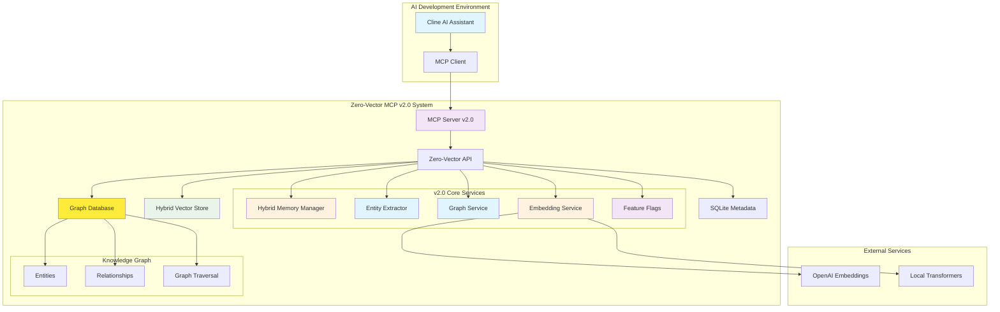

# Zero-Vector MCP v2.0: Hybrid Vector-Graph AI Memory System

A complete AI persona memory management system combining a high-performance hybrid vector-graph database server with a Model Context Protocol (MCP) interface for advanced AI memory and relationship understanding.

🔗 **Vector only v1.0 version:** [https://github.com/MushroomFleet/zero-vector-MCP](https://github.com/MushroomFleet/zero-vector-MCP)

## 🎯 Overview

Zero-Vector MCP v2.0 provides a production-ready hybrid vector-graph solution for advanced AI persona management, featuring:

- **Hybrid Vector-Graph Engine** - Combines semantic search with knowledge graph traversal
- **AI Persona Memory with Relationships** - Context-aware memory with entity extraction and graph building
- **Enhanced MCP Integration** - 18 specialized tools including graph exploration, hybrid search, and advanced content access
- **Knowledge Graph Intelligence** - Automatic entity recognition and relationship mapping
- **Production-Ready Architecture** - Feature flags, comprehensive monitoring, and zero-downtime deployment

## 🏗️ System Architecture



## 🚀 Quick Start

### Prerequisites

- Node.js 18.0.0 or higher
- 2GB+ available RAM (recommended)
- Git

### Installation

```bash
# Clone the repository
git clone https://github.com/MushroomFleet/zero-vector-MCP.git
cd zero-vector-MCP

# 1. Set up the Zero-Vector server
cd zero-vector/server
npm install
npm run setup:database
npm run generate:api-key  # Generate API key for MCP
cp env.example .env  # Add your Open AI API key
npm start

# 2. Set up the MCP server (in a new terminal)
cd MCP
npm install
cp env.example .env
# Edit .env with your Zero-Vector server URL and API key
npm start
```

### Quick Test

```bash
# Test the vector database
curl http://localhost:3000/health

# Test MCP server connection
cd MCP
npm run test:connection
```

## 📚 Component Documentation

This system consists of two main components, each with detailed documentation:

### 🗄️ Zero-Vector Server
**Location:** [`zero-vector/README.md`](zero-vector/README.md)

The core vector database server providing:
- High-performance vector storage and similarity search
- RESTful API for vector operations
- SQLite metadata persistence
- Authentication and security middleware
- Real-time monitoring and health checks

### 🔌 MCP Server v2.0
**Location:** [`MCP/README.md`](MCP/README.md)

The Model Context Protocol interface providing:
- 18 specialized tools for persona, memory, and graph management
- Hybrid vector-graph search capabilities
- Seamless integration with AI development tools
- Comprehensive error handling and validation
- Structured logging and performance monitoring

## ✨ Key Features

### Hybrid Vector-Graph Performance
- **Memory Efficiency**: 2GB optimized storage supporting 349,525+ vectors
- **Hybrid Search**: Sub-300ms search combining vector similarity with graph expansion
- **Entity Extraction**: Automatic recognition of people, concepts, events, and relationships
- **Graph Traversal**: Multi-depth relationship exploration with configurable limits
- **Scalable Architecture**: Feature-flagged deployment with zero-downtime rollback

### AI Persona Management with Knowledge Graphs
- **Persona Creation**: Configurable AI personas with memory and graph capabilities
- **Enhanced Memory Storage**: Context-aware memory with automatic entity extraction
- **Hybrid Search**: Find relevant memories using vector similarity and graph relationships
- **Knowledge Graph Building**: Automatic entity recognition and relationship mapping
- **Conversation History**: Complete conversation tracking with entity linking
- **Memory Cleanup**: Automated cleanup of old memories and orphaned graph entities

### MCP Integration Tools (18 total)
- **Persona Tools (5)**: `create_persona`, `list_personas`, `get_persona`, `update_persona`, `delete_persona`
- **Memory Tools (6)**: `add_memory`, `search_persona_memories`, `get_full_memory`, `add_conversation`, `get_conversation_history`, `cleanup_persona_memories`
- **Graph Tools (4)**: `explore_knowledge_graph`, `hybrid_memory_search`, `get_graph_context`, `get_graph_stats`
- **Utility Tools (3)**: `get_system_health`, `get_persona_stats`, `test_connection`

### Security & Production Features
- **API Key Authentication**: Secure key generation with role-based permissions
- **Rate Limiting**: Multi-tier rate limiting (global, per-key, per-endpoint)
- **Input Validation**: Comprehensive request validation and sanitization
- **Structured Logging**: Winston-based logging with performance metrics
- **Health Monitoring**: Multiple health check endpoints for different monitoring needs

## 🎮 Use Cases

### AI Assistant Memory with Knowledge Graphs (v2.0)
```javascript
// Create a persona for an AI assistant
const persona = await mcpClient.createPersona({
  name: "Technical Assistant",
  description: "Helpful coding assistant with memory and graph knowledge",
  systemPrompt: "You are a helpful technical assistant with access to knowledge graphs...",
  maxMemorySize: 1000
});

// Add important information to memory (automatically extracts entities)
await mcpClient.addMemory({
  personaId: persona.id,
  content: "John Smith from Microsoft called about the Azure project. He mentioned working with Sarah Johnson on cloud architecture.",
  type: "conversation",
  importance: 0.8
});

// Hybrid search combining vector similarity with graph expansion
const hybridResults = await mcpClient.hybridMemorySearch({
  personaId: persona.id,
  query: "cloud architecture project",
  limit: 5,
  useGraphExpansion: true,
  graphDepth: 2,
  threshold: 0.7
});

// Explore the knowledge graph for entities
const graphEntities = await mcpClient.exploreKnowledgeGraph({
  personaId: persona.id,
  query: "John Smith",
  includeRelationships: true,
  entityTypes: ["PERSON", "ORGANIZATION"]
});

// Get full content of specific memories without truncation
const fullMemory = await mcpClient.getFullMemory({
  personaId: persona.id,
  memoryId: "memory-uuid-from-search",
  include_metadata: true
});

// Search with configurable content display
const searchWithFullContent = await mcpClient.searchPersonaMemories({
  personaId: persona.id,
  query: "white hat tales",
  limit: 5,
  show_full_content: true,  // No truncation
  threshold: 0.3
});

// Search with custom preview length
const searchWithCustomPreview = await mcpClient.searchPersonaMemories({
  personaId: persona.id,
  query: "project details",
  limit: 10,
  content_preview_length: 500,  // Show 500 characters instead of default 150
  threshold: 0.4
});
```

### Enhanced Memory Context Discovery
```javascript
// Get comprehensive context for specific entities
const context = await mcpClient.getGraphContext({
  personaId: persona.id,
  entityIds: ["entity-john-smith-uuid", "entity-microsoft-uuid"],
  includeRelationships: true,
  maxDepth: 2
});

// This returns:
// - Direct memories about John Smith and Microsoft
// - Related entities (Sarah Johnson, Azure project)
// - Relationship strengths and types
// - Contextual memories through graph connections
```

### Vector Similarity Search
```javascript
// Direct vector operations through the API
const response = await fetch('http://localhost:3000/api/vectors/search', {
  method: 'POST',
  headers: {
    'Content-Type': 'application/json',
    'X-API-Key': 'your-api-key'
  },
  body: JSON.stringify({
    query: [0.1, 0.2, 0.3, /* ... 1536 dimensions */],
    limit: 10,
    threshold: 0.7
  })
});
```

### Integration with Cline
```json
{
  "mcpServers": {
    "zero-vector": {
      "command": "node",
      "args": ["C:/path/to/zero-vector-MCP/MCP/src/index.js"],
      "env": {
        "ZERO_VECTOR_BASE_URL": "http://localhost:3000",
        "ZERO_VECTOR_API_KEY": "your_api_key_here"
      }
    }
  }
}
```

## 🛠️ Development

### Project Structure
```
zero-vector-MCP/
├── zero-vector/                 # Vector database server
│   ├── server/                  # Node.js backend
│   │   ├── src/                 # Source code
│   │   ├── scripts/             # Setup scripts
│   │   ├── data/                # Database files
│   │   └── README.md            # Server documentation
│   └── README.md                # Server overview
├── MCP/                         # Model Context Protocol server
│   ├── src/                     # MCP server source
│   │   ├── tools/               # MCP tool implementations
│   │   └── utils/               # Utilities
│   ├── .env.example             # Environment template
│   └── README.md                # MCP documentation
├── DOCS/                        # Internal documentation
└── README.md                    # This file
```

### Development Setup

```bash
# Start Zero-Vector server in development mode
cd zero-vector/server
npm run dev

# Start MCP server in development mode (new terminal)
cd MCP
npm run dev

# Run tests
npm test
```

### Environment Configuration

**Zero-Vector Server:**
```bash
NODE_ENV=development
PORT=3000
MAX_MEMORY_MB=2048
DEFAULT_DIMENSIONS=1536
LOG_LEVEL=info
```

**MCP Server:**
```bash
ZERO_VECTOR_BASE_URL=http://localhost:3000
ZERO_VECTOR_API_KEY=your_api_key_here
MCP_SERVER_NAME=zero-vector-mcp
LOG_LEVEL=info
```

## 📊 Performance Characteristics

- **Vector Storage**: ~6MB per 1000 vectors (1536 dimensions)
- **Search Performance**: <50ms for 10,000+ vector corpus
- **Memory Efficiency**: 99.9% utilization of allocated buffer space
- **Throughput**: 1000+ vectors/second insertion rate
- **Capacity**: 349,525 vectors in 2GB configuration

## 🔒 Security Features

- **Authentication**: API key-based authentication with secure generation
- **Authorization**: Role-based access control with granular permissions
- **Rate Limiting**: Multiple rate limiting layers (global, per-key, per-endpoint)
- **Input Validation**: Comprehensive request validation and sanitization
- **Security Headers**: Helmet.js implementation with CSP policies
- **Audit Logging**: Complete audit trail for all operations

## 🤝 Contributing

1. Fork the repository
2. Create a feature branch (`git checkout -b feature/amazing-feature`)
3. Make your changes
4. Add tests for new functionality
5. Commit your changes (`git commit -m 'Add amazing feature'`)
6. Push to the branch (`git push origin feature/amazing-feature`)
7. Open a Pull Request

### Development Guidelines

- Follow existing code style and patterns
- Add comprehensive tests for new features
- Update documentation for any API changes
- Ensure all tests pass before submitting PR
- Include performance considerations for vector operations

## 📄 License

This project is licensed under the MIT License - see the [LICENSE](LICENSE) file for details.

## 🆘 Support

### Documentation
- **Vector Database**: See [`zero-vector/README.md`](zero-vector/README.md) for detailed server documentation
- **MCP Server**: See [`MCP/README.md`](MCP/README.md) for MCP setup and tool documentation

### Troubleshooting

**Connection Issues:**
```bash
# Check Zero-Vector server health
curl http://localhost:3000/health

# Test MCP server connection
cd MCP && npm run test:connection
```

**Common Issues:**
- Ensure Node.js 18+ is installed
- Verify API key configuration in MCP `.env` file
- Check Zero-Vector server is running before starting MCP server
- Ensure sufficient memory allocation (2GB+ recommended)

### Getting Help

- **GitHub Issues**: Report bugs and feature requests
- **Discussions**: Ask questions and share ideas
- **Wiki**: Additional documentation and examples

---

**Zero-Vector MCP v2.0** - *Production-ready hybrid vector-graph AI memory system with knowledge graph intelligence*
